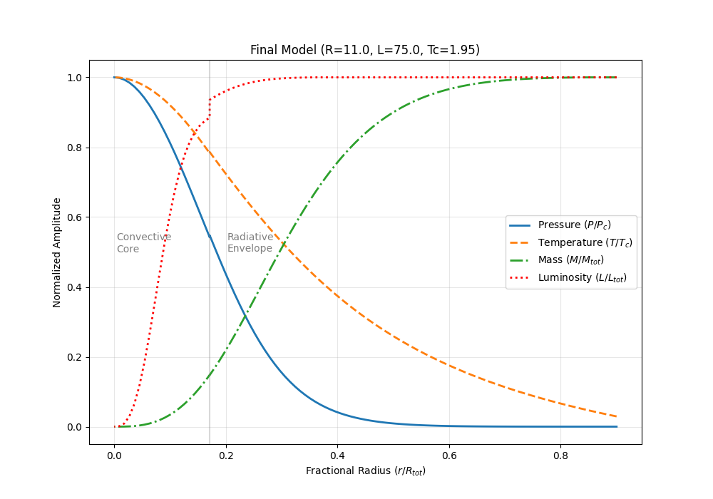

# Numerical Model of a 5 $M_\odot$ Star

## Overview
This repository contains a Python implementation of a numerical static model for the interior structure of a $5 M_\odot$ main-sequence star.

This project was developed as part of the **Stellar Astrophysics** course curriculum. The model solves the four fundamental differential equations of stellar structure assuming spherical symmetry and thermal equilibrium.

## Physics Input
The model assumes a star with the following composition and parameters:
* **Total Mass:** $M = 5.0 M_\odot$
* **Composition:** Hydrogen $X=0.75$, Helium $Y=0.22$, Metals $Z=0.03$.

The constitutive physics included are:
1.  **Equation of State (EOS):** Ideal gas pressure plus radiation pressure.
2.  **Opacity:** A combined approximate formula considering Kramer's opacity (bound-free and free-free transitions) and electron scattering.
3.  **Energy Generation:** Nuclear burning rates for both the proton-proton (pp) chain and the CNO cycle.

## Numerical Method
The problem presents a two-boundary value problem solved using a **"Shooting Method"** combined with a 4th-order Runge-Kutta (RK4) integrator.

Following the algorithms described in the course documentation, the integration is split:
1.  **Inward Integration:** Starts from the photosphere boundary conditions ($R_{tot} \approx 11.5 R_\odot$, $L_{tot} \approx 70 L_\odot$) and integrates inward towards the center.
2.  **Outward Integration:** Starts near the center ($M_r \to 0, L_r \to 0$) with an estimated central temperature ($T_c$) and integrates outward.
3.  **Fitting:** Auxiliar codes were used to estimate the best Central Temperature ($T_c$) until the pressure solutions from both integrations match at a predefined intermediate mass fitting point.

## Results

The model successfully converges, providing the profiles for Pressure ($P$), Temperature ($T$), Luminosity ($L$), and Mass ($M$) as a function of radius.

### Structure Profile
Below is the normalized plot of the structural parameters against the normalized radius ($r/R_{tot}$).



*Figure 1: Normalized interior structure of the 5 solar mass model. Note the steep gradients near the center and the transition between energy transport regions.*

## Dependencies and Usage
The code relies on standard scientific Python libraries.

### Prerequisites
* Python 3.x
* `numpy`
* `matplotlib`

Install dependencies using:
```bash
pip install -r requirements.txt
